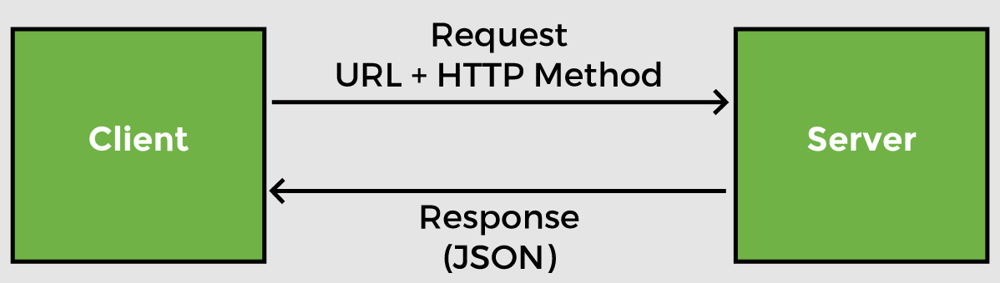
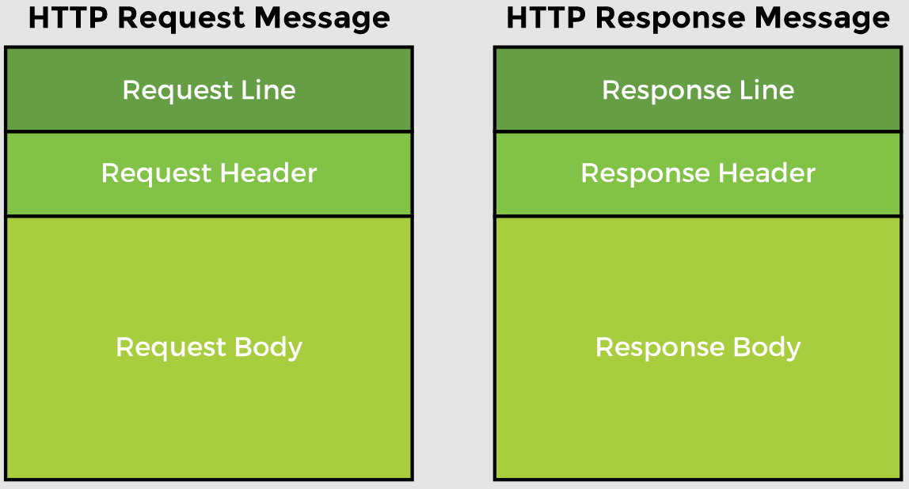
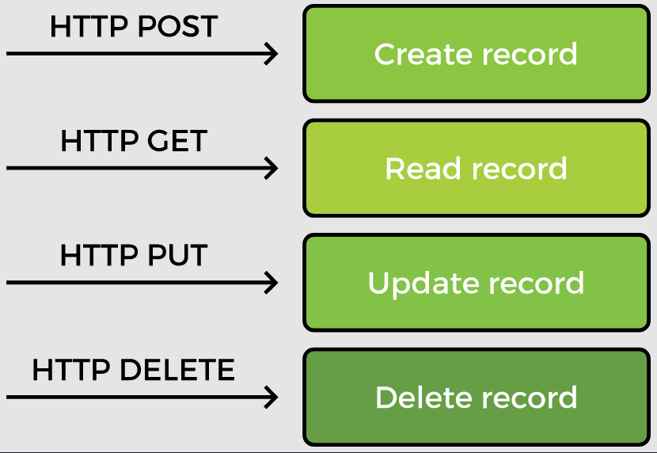

# Lesson 1: Developing REST services in Spring

## Overview

Spring provides specialized annotations such as `@RestController`, `@ResponseBody` and `@ResponseStatus` etc. that make RESTful application development easy.

Spring also automatically handles Jackson integration which makes conversion of data from JSON to POJO and vice versa a breeze. Any JSON data received by the controller is automatically converted to a POJO and any POJO returned by the controller is converted to JSON.

## Demonstrated Concepts

### REST

REST stands for the __REpresentational State Transfer__. In the REST architecture, the client and server are implemented independently. REST is also language independent, so the client and server applications can use different programming languages.

The REST architecture is _stateless_ meaning that the client only manages _session state_ and the server only manages the _resource state_. The communication between the client and server is such that every request contains all the information necessary to interpret it without any previous context.

Both the client and server know the communication format and are able to understand the message sent by the other side. REST calls can be made over HTTP. The client can send HTTP request message to the server where it is processed and an HTTP response is sent back.

#### Request Message

The request message has three parts:

1. The __request line__ contains the HTTP method (`GET` or `POST` etc.)
2. The __request header__ contains data with additional information about the request.
3. The __request body__ contains the contents of the message.

#### Response Message

1. The __response line__ contains the status code for success or redirection etc. 
2. The __response header__ contains additional information about the response like the content type and the size of the response. The client can render the data based on the content type so if it is text/html, it is displayed according to the HTML tags and if it is application/json or application/xml, it is processed accordingly. 
3. The __response body__ contains the actual message sent in response to the request.

#### HTTP methods for CRUD operations

