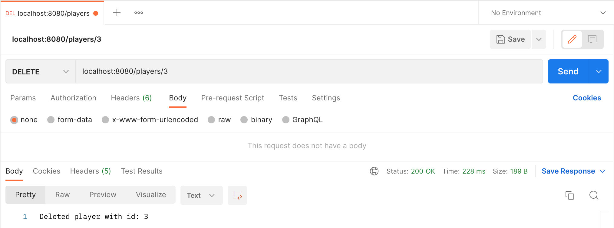
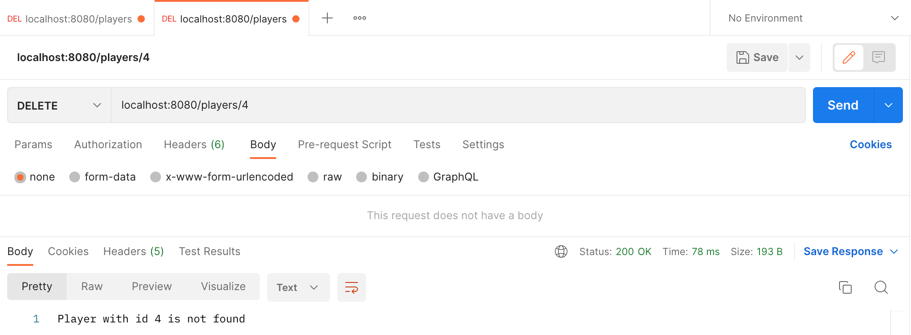
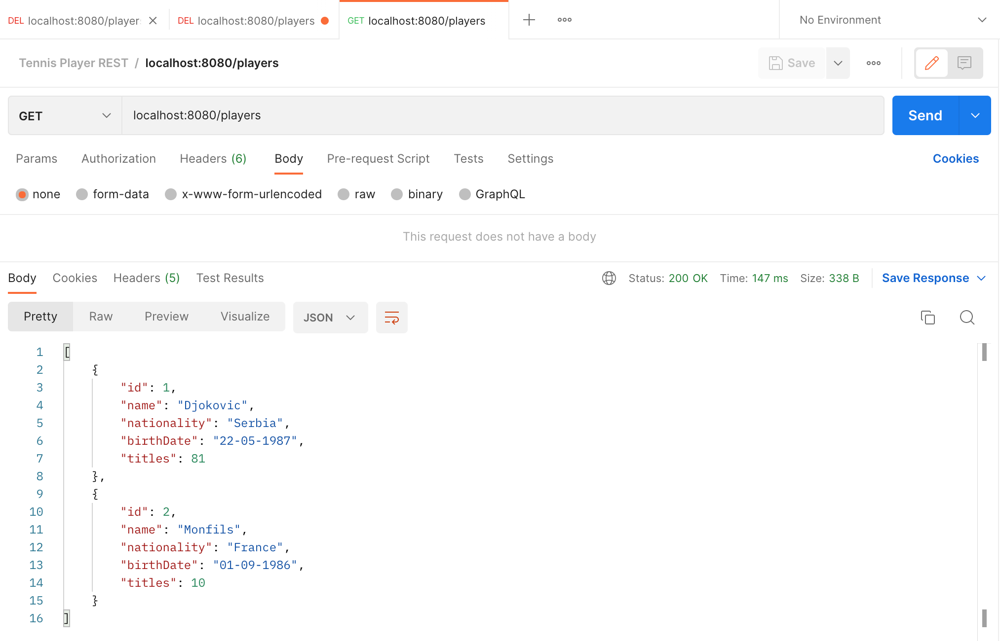

# Lesson 10: @DeleteMapping

## Overview

The HTTP `DELETE` request deletes a record. The primary key of the record to be deleted can be sent as part of the request URI or the record itself can be sent as part of the request body.


`JpaRepository` inherits two methods of the `CrudRepository` for deleting a record. 

- The `delete` method takes an entity to be deleted
- The `deleteById` method takes the primary key of the entity to be deleted. 

They both have the same function, and internally the `deleteById` method calls the `delete` method:

```java
void deleteById(ID id) { 
    delete(findById(id)); 
}
```

The difference lies in the way both methods respond when the entity to be deleted is not found. 

- The `deleteById` method throws the `EmptyResultDataAccessException` 
- The `delete` method throws a `NoSuchElementException`

In the `PlayerService` class, we create a service layer method called `deletePlayer` to handle delete functionality.

Inside the `deletePlayer` method, we call the repository method `deleteById` and pass the player’s `id`. The `deleteById` method internally calls the `findById` method, and then deletes the record.

```java
public String deletePlayer(int id) {
    repo.deleteById(id);
    return "Deleted player with id: " + id;
}
```

To handle the exception thrown when the player record is not found, we can enclose the method call in a try catch block:

```java
try {
    repo.deleteById(id);
} catch(Exception e) {
    return "Player with id " + id + "not found";
}
```

## Demonstrated Concepts

Moving on to the controller layer, we create a method `deletePlayer` to handle the `DELETE` request. It maps to the endpoint `/players/{id}`, with `id` being the path variable. The REST controller will respond with a message informing the client of the success or failure. The method is annotated with `@DeteleMapping`.

The `@PathVariable` annotation binds the `id` path variable to the method parameter `id`.

```java
@DeleteMapping("/players/{id}")
public String deletePlayer(@PathVariable int id) {
    //call service layer method 
}
```

The `@DeleteMapping` annotation is a shortcut annotation. It is the same as:

```java
@RequestMapping(method = RequestMethod.DELETE)
```

The `deletePlayer` method will delegate the call to the service layer and pass the `id` received in the `DELETE` request. On success, the method will return the deleted player’s `id` by plugging the `id` received in the request. 

If the player is not found in the database, the method will return with a message informing the client that the player was not found.

To test the new endpoint, launch the application and create a `DELETE` request in Postman. We provide the `id` of the player as part of the URI, so the request body will be _empty_. 

Send two `DELETE` requests, first to `localhost:8080/players/3`. In this case, the REST controller responds with a _success_ message.



Send the second `DELETE` request to `localhost:8080/players/4` and the REST controller should respond that the player with `id` 4 is _not found_.



The results can be verified by using a `GET` request to `/players`. It can be seen that only 2 players remain in the database.

