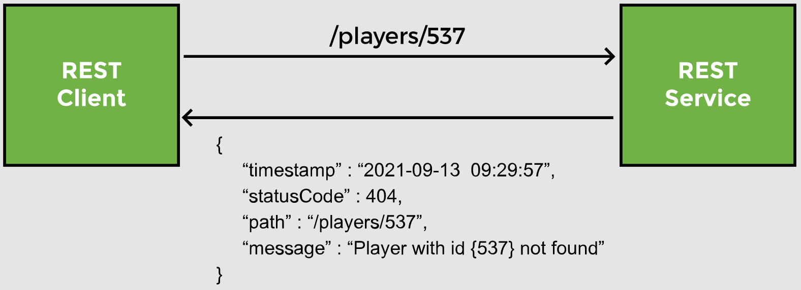

# Lesson 11: Exception Handling I

## Overview

When the client sends a request to fetch, update or delete a player record not found in the database, an internal server error occurs. The information contained in the response is verbose and of interest to developers only.

Let's learn how to send a client-friendly JSON response when a player record is not found.



## Demonstrated Concepts

### Custom error response class

We first create a __class__ with fields like status code, error message, path/URI, and timestamp. An __object__ of this class will be created when an exception occurs and sent back to the client as the response. Jackson will automatically handle data binding and send this object as a JSON response.

```java
public class PlayerErrorResponse {
    @JsonFormat(pattern="yyyy-MM-dd HH:mm:ss")
    private ZonedDateTime timestamp;
    private int statusCode;
    private String path;
    private String message;

    //constructor
    //getters and setters
}
```

### Custom exception class

When the REST service receives a bad request, we want it to throw an exception of our custom type. Since the exception is thrown when the player is not found , we call the class `PlayerNotFoundException`. This class extends the `RunTimeException` class.

```java
public class PlayerNotFoundException extends RuntimeException {
    //superclass constructors
}
```

The `RunTimeException` class contains multiple constructors and we will use one of them to throw an exception when the player is not found.

### `throw` exception

`PlayerNotFoundException` is thrown at multiple places in the code. 

In the `PlayerService` class, the player `Id` is received by the following methods: `getPlayer`, `updatePlayer2`, `patch`, `updateTitles`, and `deletePlayer2`. We will update these methods to check if the `Id` received is valid and throw a `PlayerNotFoundException` if there is no record in the database for the given `Id`.

> __Note from `ginny100`:__ I want to keep the implementations of the `updatePlayer` and `deletePlayer` methods from some previous lessons so I create `updatePlayer2` and `deletePlayer2` methods to demonstrate the use of Exception Handling in this lesson.