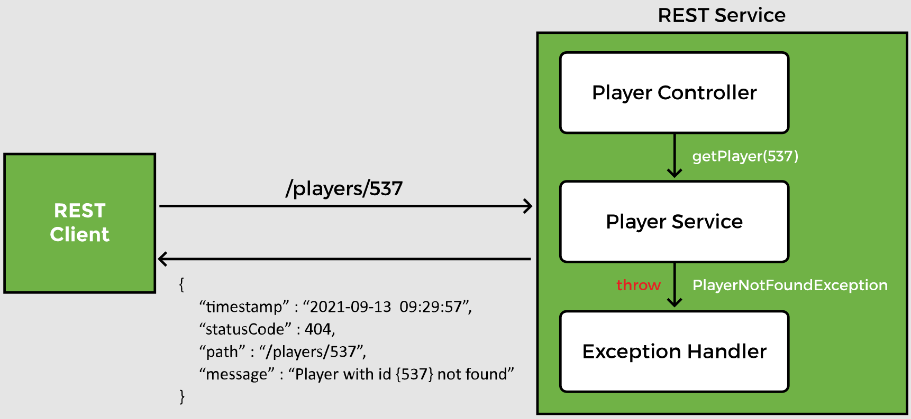
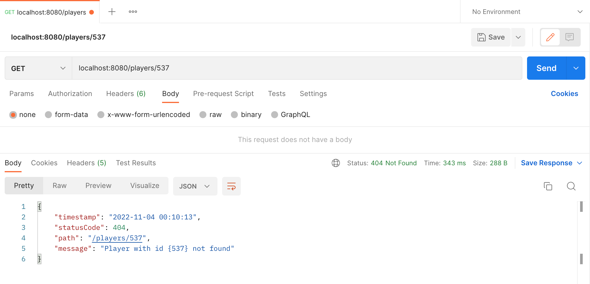
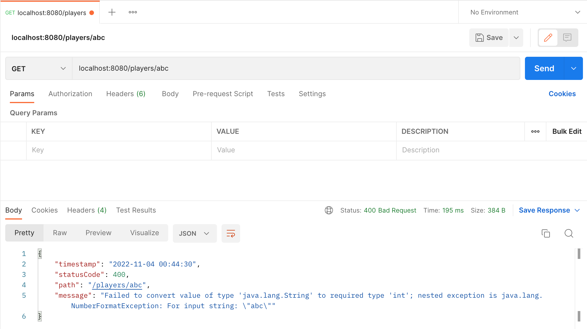
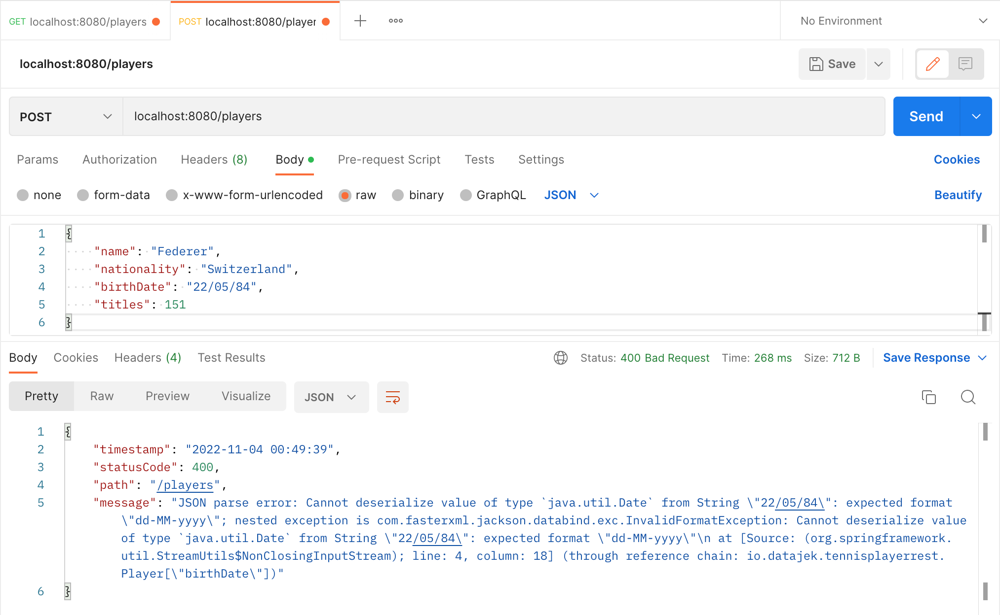

# Lesson 12: Exception Handling II

## Overview

A best practice in exception handling, is to have centralized exception handlers that can be used by all controllers in the REST API.

## Demonstrated Concepts

### `@ControllerAdvice`

Since exception handling is a cross-cutting concern, Spring provides the `@ControllerAdvice` annotation.

`@ControllerAdvice` intercepts requests going to the controller and responses coming from controllers.


The `@ControllerAdvice` annotation can be used as an interceptor of exceptions thrown by methods annotated with `@RequestMapping` or any of its shortcut annotations. The exception handling logic is contained in the global exception handler which handles all exceptions thrown by the `PlayerController`.



The class `PlayerExceptionHandler` annotated with the `@ControllerAdvice` annotation acts as a global exception handler.

```java
@ControllerAdvice
public class PlayerExceptionHandler {

}
```

This class has methods to handle different types of exceptions. Inside `PlayerExceptionHandler` class, the handler method called `playerNotFoundHandler` is used to catch the `PlayerNotFoundException` exception thrown by the methods in `PlayerService` class. This handler method creates an appropriate response for the client.

```java
public ResponseEntity<PlayerErrorResponse> playerNotFoundHandler (PlayerNotFoundException ex, HttpServletRequest req) {

}
```

The input to `playerNotFoundHandler` is the type of the exception it will handle as well as the `HttpServletRequest` object. 

In our case, the exception will be of type `PlayerNotFoundException`. The `playerNotFoundHandler` method returns a `ResponseEntity` object containing the HTTP response when the exception occurs. An HTTP response message has three parts: response line, header and body. We can set these attributes in our handler method and configure the HTTP response. The `ResponseEntity` object is generic, and we can send any type as the response body. In our case, the response body will contain an object of the `PlayerErrorResponse` class.

### `@ExceptionHandler`

The `@ExceptonHandler` annotation on a method, marks it as a method that will handle exceptions. Spring automatically checks all methods marked with this annotation when an exception is thrown. If it finds a method whose input type matches the exception thrown, the method will be executed.

```java
@ExceptionHandler
public ResponseEntity<PlayerErrorResponse> playerNotFoundHandler (PlayerNotFoundException ex, HttpServletRequest req) {
    PlayerErrorResponse error = new PlayerErrorResponse(ZonedDateTime.now(), HttpStatus.NOT_FOUND.value(), req.getRequestURI(), ex.getMessage());

    return new ResponseEntity<> (error, HttpStatus.NOT_FOUND);
}
```

The object of the `PlayerErrorResponse` class inside the `playerNotFoundHandler` method is returned as a `ResponseEntity` object.

The `ResponseEntity` class provides a variety of constructors to create an object using the status code, header and body or a combination of the three. Here, we have used the constructor which creates a `ResponseEntity` object with a given body and status code. The other constructor variants for creating the `ResponseEntity` object are:
- `ResponseEntity(HttpStatus status)`
- `ResponseEntity(MultiValueMap<String, String> headers, HttpStatus status)`
- `ResponseEntity(T body, MultiValueMap<String, String> headers, HttpStatus status)`

We can test the application by sending a `GET` request to `localhost:8080/players/537`. When the REST Service receives a bad request, it will return a custom JSON response instead of the `500 Internal Server Error`. The response header also shows the `404` status code.



### Generic exception handler

The handler method `genericHandler` in the `PlayerExceptionHandler` class catches all exceptions and sends a custom response.

A `PlayerErrorResponse` object inside the `genericHandler` method is the body of the response. Since this method is a generic exception handler, it will set the status code to `400` which corresponds to HTTP status code for __BAD_REQUEST__.

```java
@ExceptionHandler
public ResponseEntity<PlayerErrorResponse> genericHandler (Exception ex, HttpServletRequest req){

    PlayerErrorResponse error = new PlayerErrorResponse(ZonedDateTime.now(), HttpStatus.BAD_REQUEST.value(), req.getRequestURI(), ex.getMessage());
    
    return new ResponseEntity<> (error, HttpStatus.BAD_REQUEST);
}
```

The `ResponseEntity` object is returned with the response body and the Http status of `BAD_REQUEST`.

The new handler can be tested by sending a `GET` request to `localhost:8080/players/abc`. 



This handler is also be executed in case of a bad `POST` request sent to `localhost:8080/players` such as

```json
{
    "name": "Federer",
    "nationality": "Switzerland",
    "birthDate": "22/05/84",
    "titles": 151
}
```

