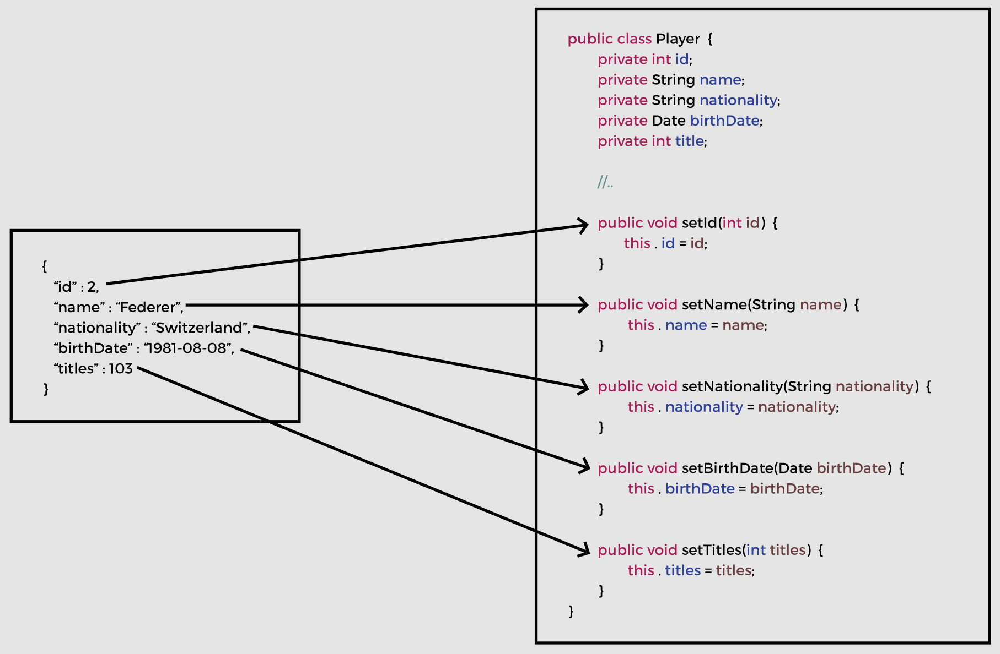

# Lesson 2: JSON Data Binding

## Overview

The most commonly used data formats in a REST application are JSON and XML.

JSON (a.k.a JavaScript Object Notation) is a collection of name-value pairs, which the application processes as a string. So, instead of using HTML or JSP to send data, it is passed as a String and the application can process and render the data accordingly. 

JSON is language independent and can be used with any programming language.

## Demonstrated Concepts

### Syntax

Rules:

- A JSON object is defined between curly braces (`{ }`). 
- The object consists of members in the form of comma separated name-value pairs. 
- The names and values are separated by colon (`:`). 
- Names are provided in double quotes (`""`) and are on the _left_ side of the colon. 
- The values are on the _right_ side of the colon. 
- If the value is a _string_, it is written in double quotes. 
- Arrays in JSON are written within square brackets (`[ ]`) that contains a comma separated list of values. 
- An object can contain nested objects. 
- JSON objects can have __null__ value. 
- Boolean values __true__ and __false__ are also allowed.

Example:

```json
{
  "id": 1,
  "fname": "John",
  "lname": "Doe",
  "hobbies": ["painting", "reading", "coding"],
  "address": {
    "city": "Adelaide",
    "country": "Australia"
  }
}
```

### Java - JSON data binding

A Plain Old Java object (a.k.a POJO) can be converted into a JSON object and vice versa through a process called __data binding__.

### Jackson Project

__Jackson Project__ handles data binding between Java and JSON as well as provides support for data binding with XML. Spring framework uses Jackson for data binding. 

The Jackson data binding API is present in the __com.fasterxml.jackson.databind__ package.

The following maven dependency adds Jackson support to the project:

```xml
<dependency>
    <groupId>com.fasterxml.jackson.core</groupId>
    <artifactId>jackson-databind</artifactId>
    <version>2.12.3</version>
</dependency>
```

Jackson converts JSON data to a Java object by calling the corresponding setter methods to populate the class members. If a setter method matching a JSON property is not found, an exception is thrown.



The Jackson annotation `@JsonIgnoreProperties` can be used to bypass the exception by setting the `IgnoreUnknown` attribute to `true`. This feature is useful when the JSON file contains more properties, but we are only interested in a few of them.