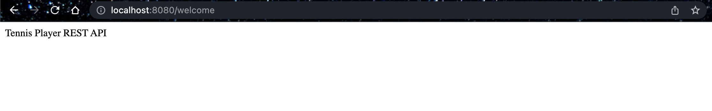
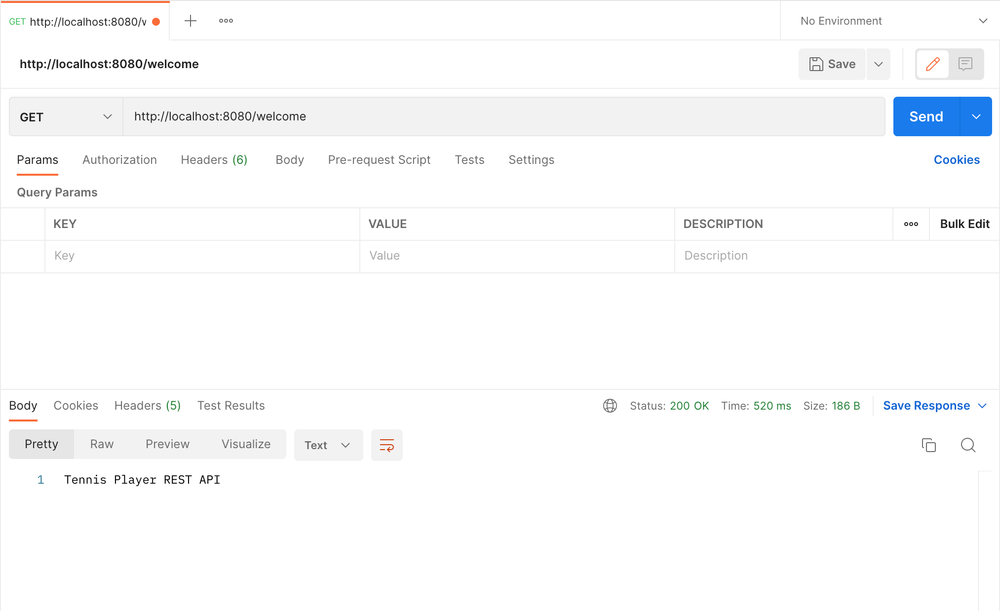

# Lesson 4: Creating a REST Controller

## Overview

In this lesson, we create a REST service with a request mapping `/welcome` and send it a request from a REST client (web browser or Postman). The service will respond with a welcome message.

## Demonstrated Concepts

### `@RestController`

`@RestController` annotation is an extension of `@Controller` annotation. 

It has support for REST requests and responses and automatically handles the data binding between the Java POJOs and JSON.

```java
@RestController
public class PlayerController{

}
```

### Adding request mapping

We set up a mapping for the request using the `@GetMapping` annotation

```java
@GetMapping("/welcome")
public String welcome() {
    return "Tennis Player REST API";
}
```

This code creates a RESTful endpoint `/welcome` which can be accessed from the REST client and returns the message string to the client.

### Testing the RESTful endpoint

We can test the REST endpoint with a web browser as well as Postman. You can run the code on your local machine and access the results by typing the URL `localhost:8080/welcome` in the web browser and it will return the response.



We can test the same URL with Postman as well. For this, we will send a `GET` request to the URL as shown below:

