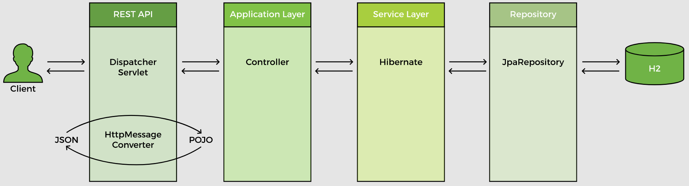
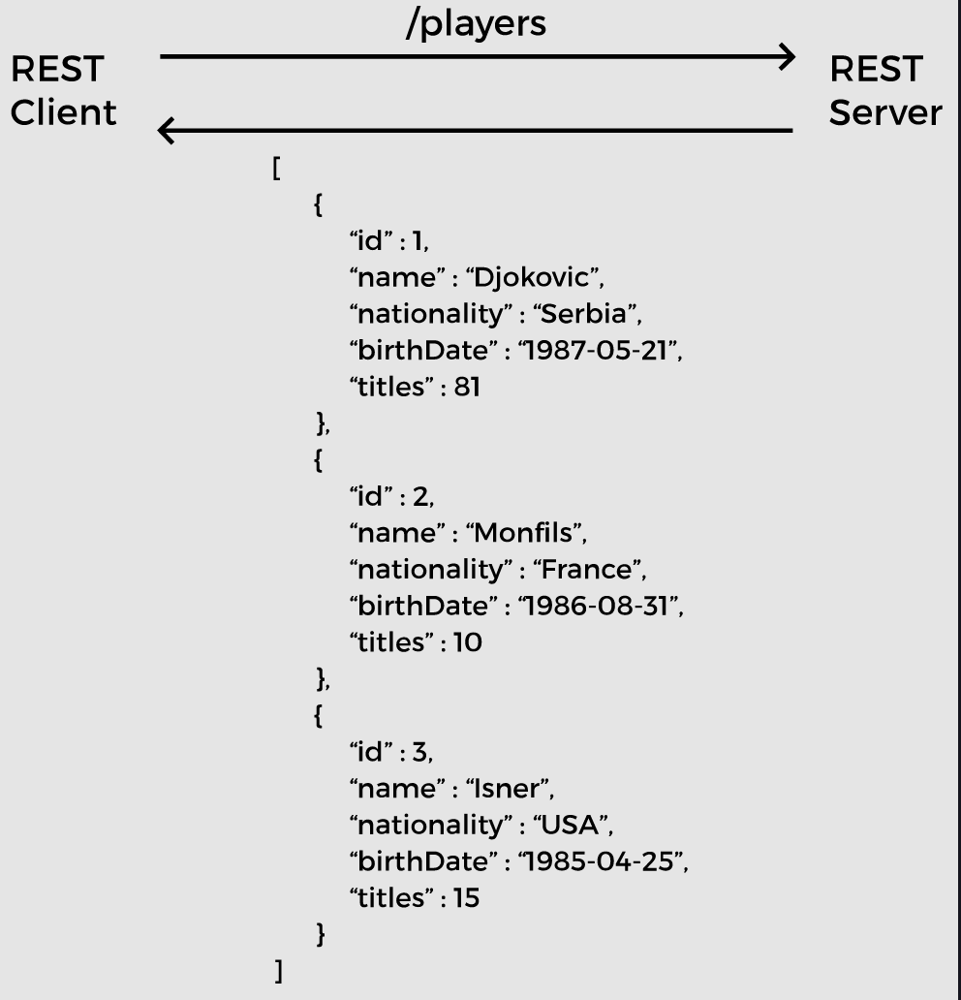
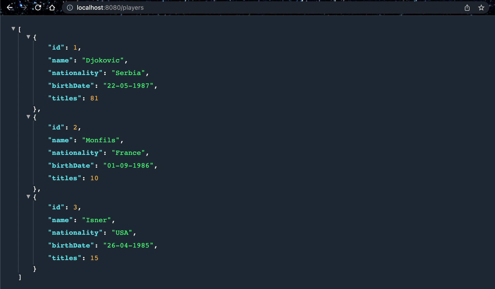
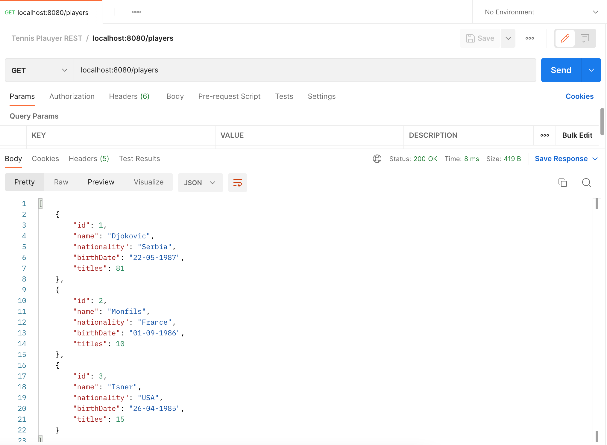

# Lesson 5: @GetMapping

## Overview

Starting from this lesson, we will build a REST service that provides basic CRUD functionality. The flow of request is shown below:



In this lesson, we create an endpoint for retrieving the list of players from the database. The REST client will send a request to `/players`. The REST service will respond with a JSON array of all players.



In order to retrieve the list of players from the database, we will write a method `getAllPlayers` in the `PlayerService` class. This method will call a repository method and return a list of objects.

```java
public List<Player> getAllPlayers() {
    //call repository method
}
```

To be able to use methods from the `PlayerRepository`, we have autowired it in the `PlayerService` class.

```java
@Service
public class PlayerService {
 
    @Autowired
    PlayerRepository repo;
 
    //...
}
```

## Demonstrated Concepts

### `findAll()`

Since we have used the `JpaRepository` interface for our `PlayerRepository` which provides all the basic methods for CRUD operations, there is no need to write any implementation for the methods. 

We can simply call methods provided by the `JpaRepository` from the service layer. The `JpaRepository` provides the `findAll()` method that returns a `List` of objects.

```java
public List<Player> getAllPlayers() {
    return repo.findAll();
}
```

Back to the controller, we create a method on which the `/players` request will be mapped. Since `/players` is a `GET` request, we use the `@GetMapping` annotation on the method as follows:

```java
@GetMapping("/players")
public List<Player> getAllPlayers() {
    //call service layer method
}
```

The `@GetMapping` annotation maps HTTP `GET` requests to controller methods. It is a shortcut for:

```java
@RequestMapping(method = RequestMethod.GET)
```

The controller method calls the service layer method, `getAllPlayers`. To be able to use the `PlayerService` methods, we autowire `PlayerService` in the `PlayerController` class.

```java
@RestController
public class PlayerController {

    @Autowired
    PlayerService service;

}
```

The `getAllPlayers` method returns a `List` of `Player` objects. The REST API will convert that list of POJOs to JSON and return it to the client.

```java
@GetMapping("/players")
public List<Player> getAllPlayers() {
    return service.getAllPlayers();
}
```

We can test the REST endpoint with a web browser as well as Postman. You can run the code on your local machine and access the results by typing the URL `localhost:8080/players` in the web browser and it will return the response.



We can test the same URL with Postman as well. For this, we will send a `GET` request to the URL as we did in the last lesson.

