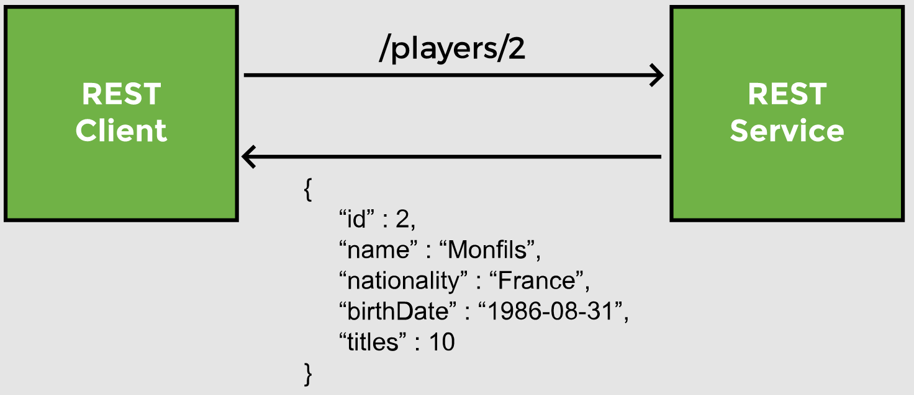
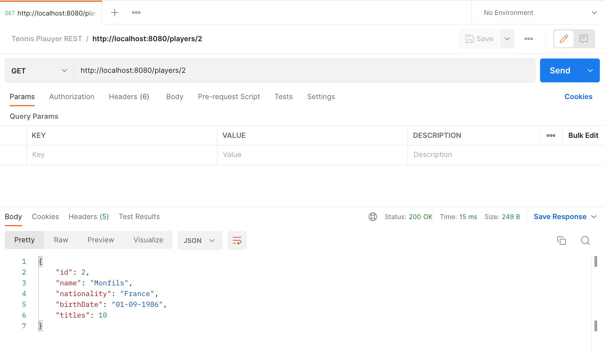
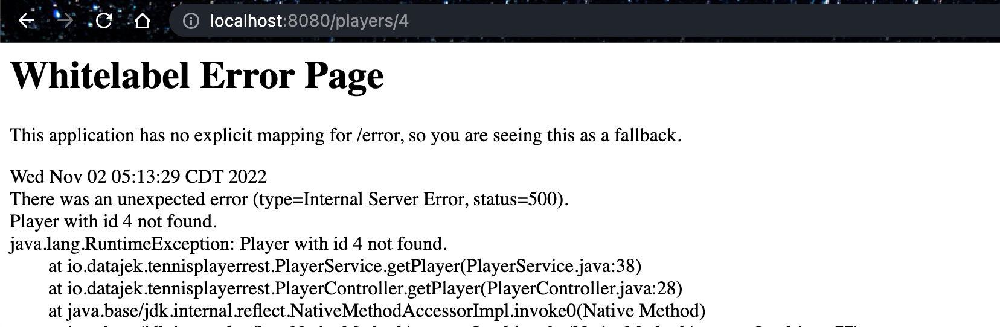
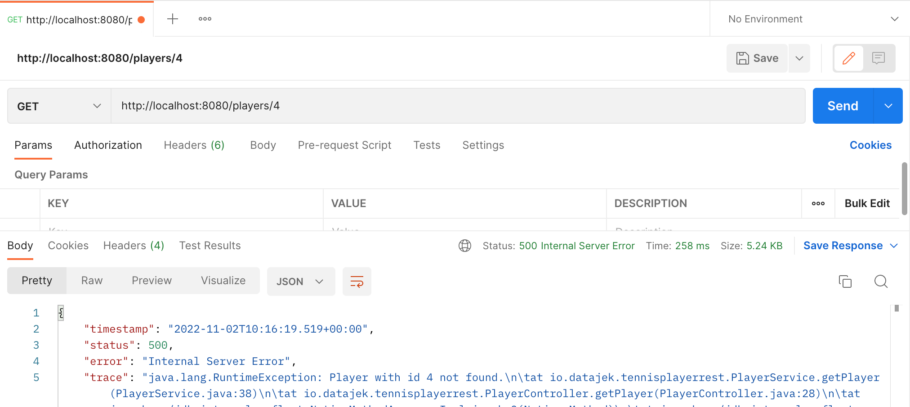

# Lesson 6: @PathVariable

## Overview

In this lesson we create a new endpoint for our REST API to retrieve a single player based on the id field. We fetch the required player from the `player` table.

__Path variables__ are a way of parameterizing the path or endpoint to accept data. Path variables are written in curly braces (`{}`). When the client sends a request, it passes a value in place of the path variable.


The REST client sends a request to `/players/{playerId}`, where `playerId` is a path variable. So the actual call may be `/players/2`. The REST service will return the player with `id` 2 from the player table, which is Monfils.



`JpaRepository` interface provides us with methods for all basic CRUD operations. We need to write a service method to call the repository.

```java
@Service
public class PlayerService {
 
    @Autowired
    PlayerRepository repo;

    public Player getPlayer(int id) {
        //find and return the player
    }
    //...
 }
```

## Demonstrated Concepts

### `findById`

To retrieve an entity based on the id, `JpaRepository` provides the `findById` method. This method has a return type of `Optional`. 

`Optional` is a design pattern introduced in Java 8, where instead of writing code to check for __null__ values, we can see if a value is present in the `Optional`.

```java
public Player getPlayer(int id) {
    return repo.findById(id);     //results in type mismatch error...
}
```

Since `findById` does not return a `Player` object, we will get a type mismatch error when we try to return the result. The way to go about it, is to create a _temporary variable_ to store the result of the method call. We create an `Optional` named `tempPlayer`.

```java
public Player getPlayer(int id) {

    Optional<Player> tempPlayer = repo.findById(id);
    
    return null;
}
```

We also need a `Player` object named `p` which is assigned __null__ value.

```java
public Player getPlayer(int id) {

    Optional<Player> tempPlayer = repo.findById(id);
    
    Player p = null;
 
    return p;
}
```

Next, we check if the value of `tempPlayer` is present using the `isPresent` method. 

The `get` method can be used to retrieve the value and assign it to `p`. Player `p` is returned at the end of the method.

```java
public Player getPlayer(int id) {

    Optional<Player> tempPlayer = repo.findById(id);    
    Player p = null;

    //if the Optional has a value, assign it to p       
    if(tempPlayer.isPresent())
        p = tempPlayer.get();

    return p;
}
```

In case the `if` condition evaluates to `false`, meaning that the `Player` was not found, we can throw an exception to let the user know that the player with the given ID does not exist.

```java
public Player getPlayer(int id) {

    Optional<Player> tempPlayer = repo.findById(id);
    
    Player p = null;
    
    //if the Optional has a value, assign it to p       
    if(tempPlayer.isPresent())
        p = tempPlayer.get();

    //if value is not found, throw a runtime exception      
    else
        throw new RuntimeException("Player with id "+ id + " not found.");
    
    return p;
}
```

In this approach of coding, we have used `Optional` and avoided explicitly checking for __null__ values.

### `getOne`

Alternatively, the `JpaRepository` provides the `getOne` method which returns an object. This method throws an `EntityNotFoundException` if the object does not exist. When using this method, we explicitly need to check for __null__ values.

In the controller class, we create a method `getPlayer` for retrieving a player by id. The endpoint `/players/{id}` maps to this method. We set up a `@GetMapping` for `/players/{id}`, where `id` in curly braces means that it is a __path variable__.

```java
@GetMapping("/players/{id}")
public Player getPlayer() {
    //call service layer method
}
```

Behind the scenes, Jackson will convert the player object to JSON.

### `@PathVariable`

Since there is a path variable in the endpoint, we need to bind it with a method parameter. The `@PathVariable` annotation binds the path variable `{id}` from the URL to the method parameter `id`. By default, both the names must be the same for the binding to work.

```java
public Player getPlayer(@PathVariable int id) {
    return service.getPlayer(id);
}
```

If the names of the path variable and the method parameter are different, then we need to specify the path variable as argument of the `@PathVariable` annotation. In the code snippet below, the path variable `id` will bind with the variable `playerId`.

```java
public Player getPlayer(@PathVariable("id") int playerId) {

}
```

We can test the REST endpoint with a web browser as well as Postman. You can run the code on your local machine and access the results by typing the URL `localhost:8080/players/2` in the web browser and it will return the response.


We can test the same URL with Postman as well. For this, we will send a `GET` request to the URL as we did in the last lesson.



### Error handling

If a `GET` request is sent for a player record which is not present in the list or the user enters a character in place of an int for the path variable, the application will throw an error.

We can test the REST endpoint with a web browser as well as Postman. You can run the code on your local machine and access the results by typing the URL `localhost:8080/players/4` in the web browser and it will respond with an error.



We can test the same URL with Postman as well. For this, we will send a `GET` request to the URL as we did in the last lesson.

