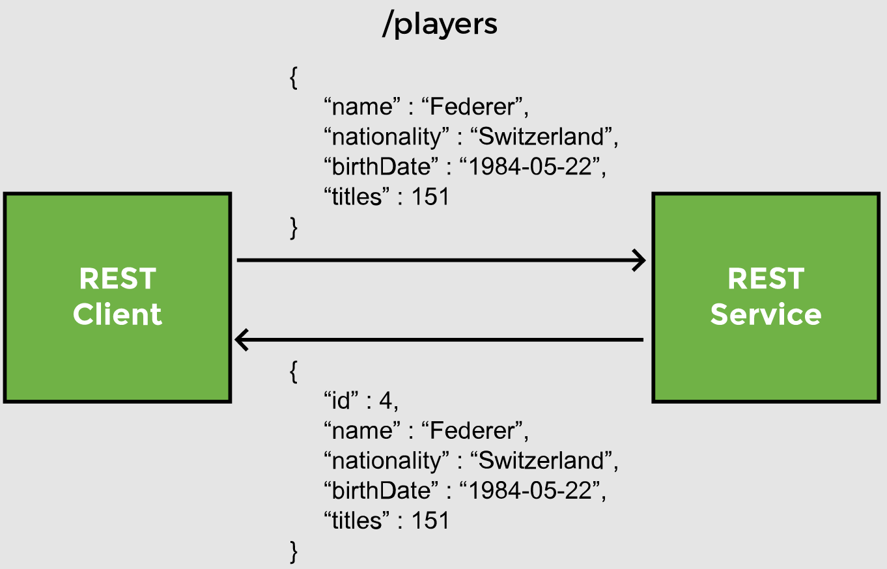
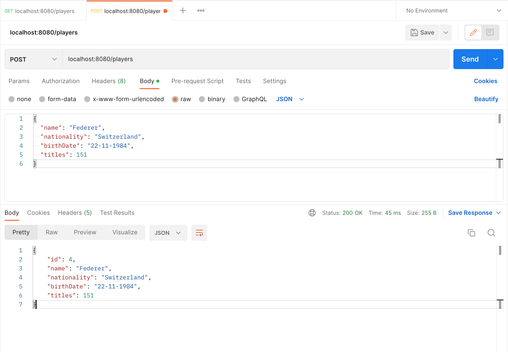
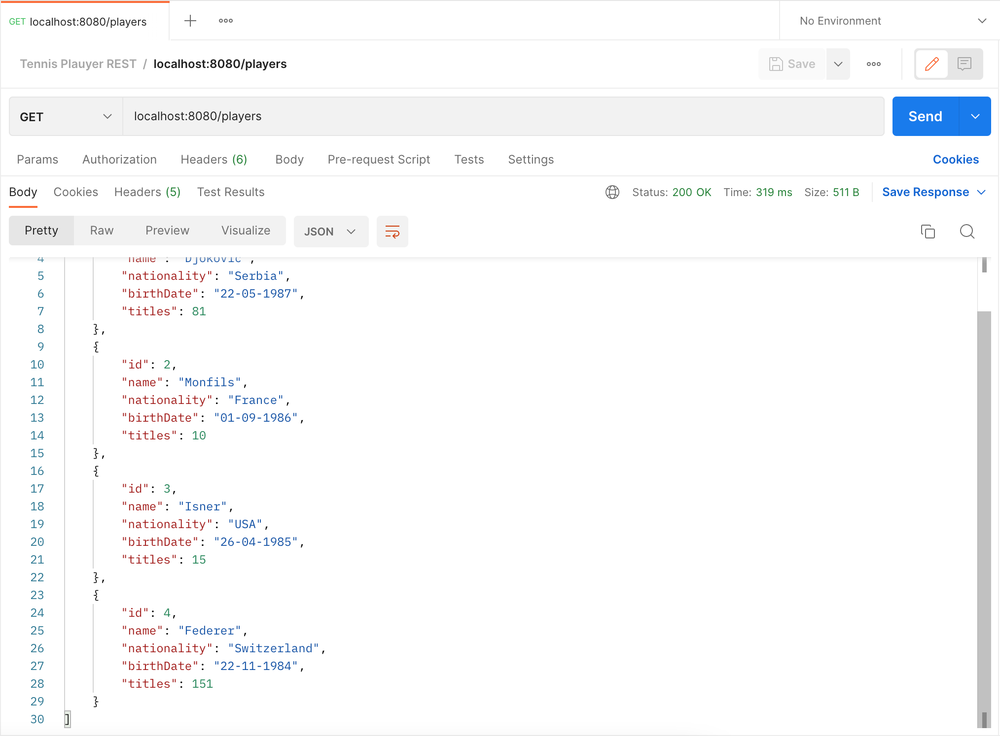

# Lesson 7: @PostMapping

## Overview

In this lesson, we create an endpoint for the REST API which creates a new player and adds it to the database.



We begin by writing the service layer method named `addPlayer`. It takes a Player object as parameter and returns the entity that has been added.

```java
public Player addPlayer(Player p) {
    //call repository method to add a player object to the player table
}
```

## Demonstrated Concepts

### `save` method

The `JpaRepository` interface inherits a method from the `CrudRepository` called `save`. 

The `save` method handles both _inserts_ and _updates_. To distinguish between an `INSERT` and `UPDATE` operation, it checks the primary key of the object that is being passed to it. If the primary key is empty or `null`, an `INSERT` operation is performed, otherwise an `UPDATE` to an existing record is performed.

```java
public Player addPlayer(Player p) {
    return repo.save(p);
}
```

The calling method will ensure that the primary key, `Id`, in the `Player` object is empty so that the record gets inserted.

### `@PostMapping`

We create a method `addPlayer` in the `PlayerController` class. This method has a mapping for a `POST` request to `/players`. The method will return the inserted record back to the client.

```java
@PostMapping("/players")
public Player addPlayer(Player player) {

}
```

The `@PostMapping` annotation maps HTTP `POST` requests to controller methods. It is a shortcut annotation for:

```java
@RequestMapping(method = RequestMethod.POST)
```

### `@RequestBody`

The client will send the player data in the request body as JSON. Jackson will convert the incoming JSON data to POJO. The `@RequestBody` annotation handles this conversion and binds the data in the request body to a method parameter.

```java
@PostMapping("/players")
public Player addPlayer(@RequestBody Player player) {

}
```

The `@RequestBody` annotation binds the JSON from the request to the `Player` object. It converts JSON to POJO without us having to parse the request body. We can directly use the data in the `player` object now.

Inside the `addPlayer` method, we set the primary key to zero in order to ensure that if the client accidentally passes the id of a player to be added, we remove it from the request _before_ delegating the call to the service layer. The `save` method offered by the `JpaRepository` works for both `INSERT` and `UPDATE` requests by checking the primary key and performs an `INSERT` or `UPDATE` operation depending upon its value.

```java
@PostMapping("/players")
public Player addPlayer(@RequestBody Player player) {
    player.setId(0);
}
```

By overwriting the `Id` with zero, we are effectively setting it to `null` or empty. Then, we just delegate this request to the service layer.

```java
@PostMapping("/players")
public Player addPlayer(@RequestBody Player player) {
    player.setId(0);
    return service.addPlayer(player);
}
```

The response from the REST controller will contain the player’s name, nationality, birth-date, titles, and the Id that was automatically generated by Hibernate.

We can now test the newly created endpoint with Postman. To send data to a REST service, we need to create a `POST` request and use the URL `localhost:8080/players`.

The body of our `POST` request can be

```json
{
  "name": "Federer",
  "nationality": "Switzerland",
  "birthDate": "22-11-1984",
  "titles": 151
}
```

Remember we don't pass the id because the system will auto generate that value for us. The controller method also checks the `Id` and sets it to zero, even if it is passed in the request.




> __Note from `ginny100`:__ I am not sure why, but I actually had to send several `POST` requests in order to successfully add a new player to the database and get the result above.

We can verify the `INSERT` by sending a `GET` request to the REST API at `localhost:8080/players`. The response now contains 4 players, which verifies that a player has been added to the database.

