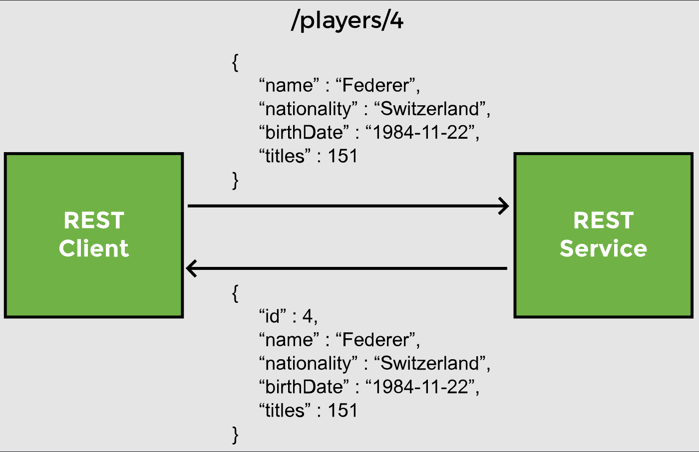
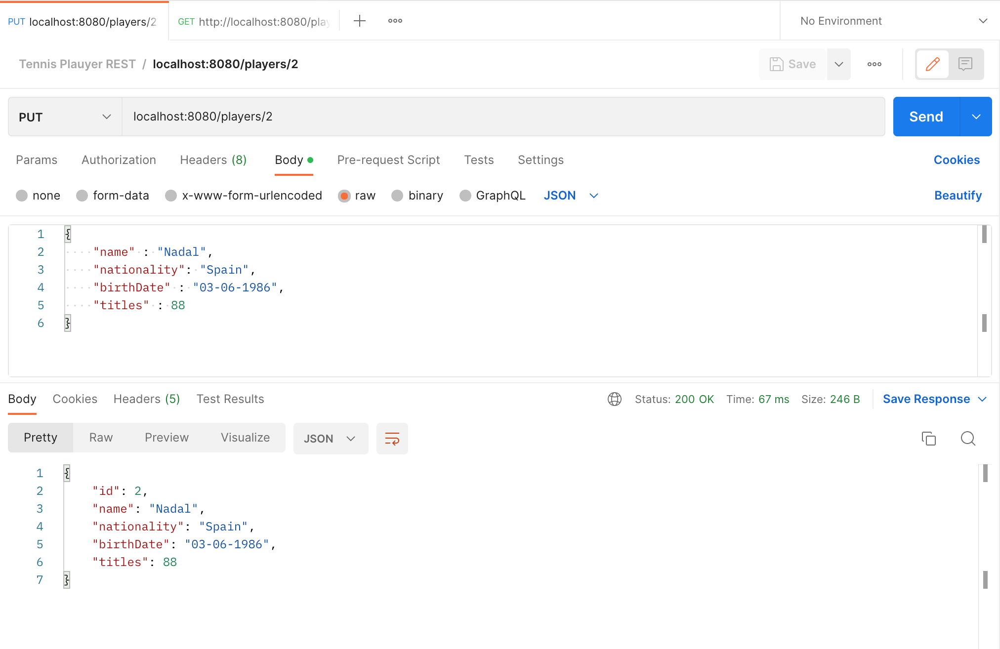
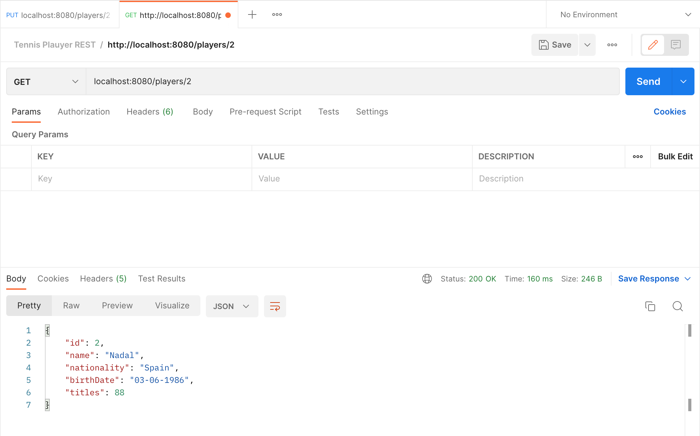
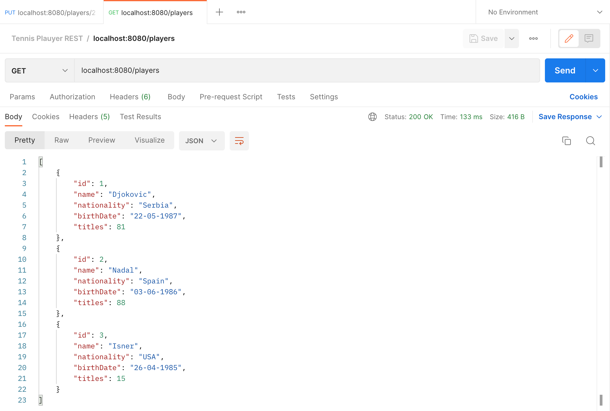

# Lesson 8: @PutMapping

## Overview

In this lesson, we create an endpoint to edit a player record and update his information in the database.

The HTTP `PUT` request is used for updates.



In the `PlayerService` class, we create a method called `updatePlayer`, which takes a player’s Id and a Player object as arguments and returns the updated Player object.

```java
public Player updatePlayer(int id, Player p) {
    //call repository method to update the player
}
```

The primary key passed in the method is used to fetch the existing record from the database. We use the `getReferenceById` method like so:

```java
public Player updatePlayer(int id, Player p) {
    
    //get player object by Id
    Player player = repo.getReferenceById(id);
    
    //update player information in database
}
```

Once we get the old player record from the database in `player`, we modify it based on the information in the `Player` object `p`, received as argument.

For each field, we call the __getter__ methods on `p` to fetch the new information. Then, we will overwrite the old information by calling __setter__ methods on `player`.

```java
//update player details
player.setName(p.getName());
player.setNationality(p.getNationality());
player.setBirthDate(p.getBirthDate());
player.setTitles(p.getTitles());
```

Finally, we call repository methods to save the updated information. `JpaRespository` inherits the `save` method offered by the `CrudRepository`, which handles both `INSERT` and `UPDATE` operations on the repository by checking the primary key of the object. `save` performs an update if the key is present. Otherwise, if the key is zero or __null__, a new record is inserted into the database.

```java
public Player updatePlayer(int id, Player p) {
    
    //get player object by ID
    Player player = repo.getOne(id);
    
    //update player details
    player.setName(p.getName());
    player.setNationality(p.getNationality());
    player.setBirthDate(p.getBirthDate());
    player.setTitles(p.getTitles());
    
    //save updates
    return repo.save(player);
}
```

## Demonstrated Concepts

### `@PutMapping`

Now, we can write the controller method to receive a `PUT` request.

We send the `Id` of the player to be updated as a path variable. The request body contains the JSON with the updated information of the player. The method will return a `Player` object which will be converted to JSON and sent back to the client.

```java
@PutMapping("/players/{id}")
public Player updatePlayer(@PathVariable int id, @RequestBody Player player) {
 
}
```

The `@PutMapping` is a shortcut annotation for mapping a PUT request to a controller method. It is the same as:

```java
@RequestMapping(method=RequestMethod.PUT)
```

The `@PathVariable` annotation will extract the path variable `id` from the incoming request `/players/{id}` and bind it with the `id` method parameter.

The controller method delegates the call to the service layer by calling its update method and passing the `id` and the `Player` object containing the information to be updated:

```java
@PutMapping("/players/{id}")
public Player updatePlayer(@RequestBody Player player, @PathVariable int id) {
    return service.updatePlayer(id, player);
}
```

To test the new endpoint, we create a `PUT` request in Postman. Suppose we want to update the information of player with `id` 2 so the URL is `localhost:8080/players/2`. The body of the request can be:

```json
{
    "name" : "Nadal",
    "nationality": "Spain",
    "birthDate" : "03-06-1986",
    "titles" : 88
}
```



After the request has been sent, the player with `id` 2 is now Nadal. This can be verified by creating a `GET` request to `localhost:8080/players/2`.



We can also verify by making a `GET` request to `localhost:8080/players`. Notice that player with `id` 2 has been updated in the table.

