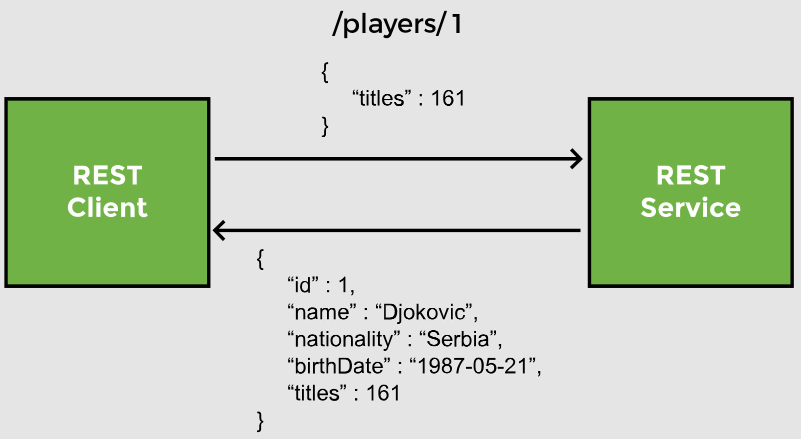
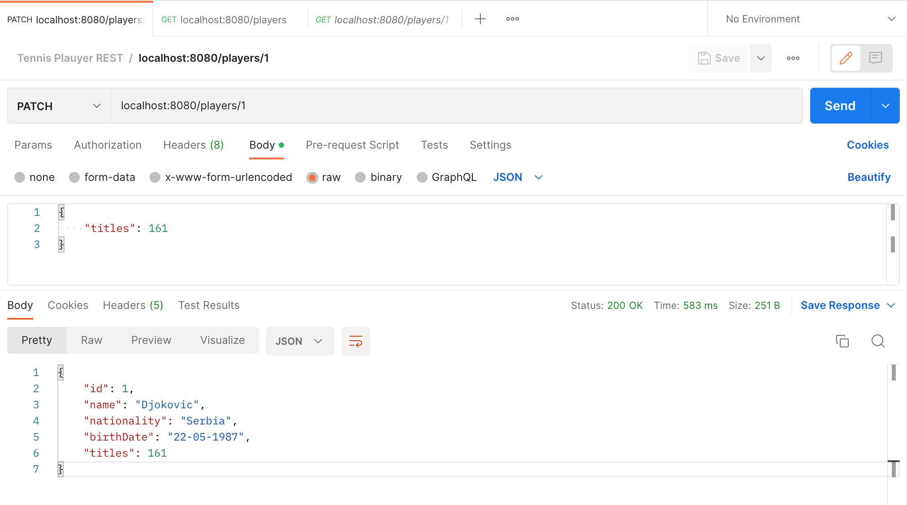
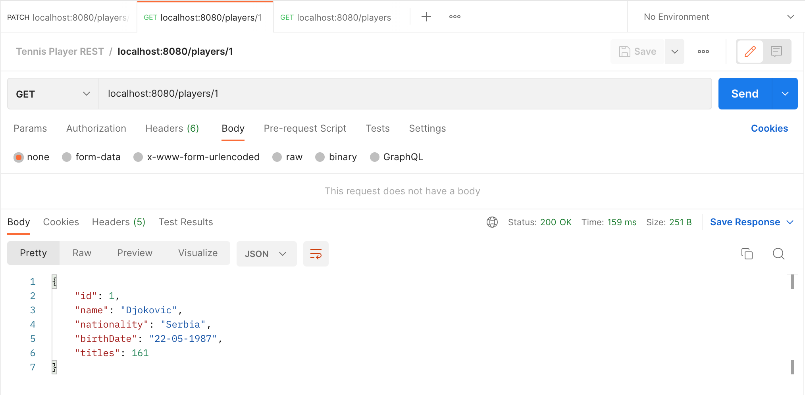
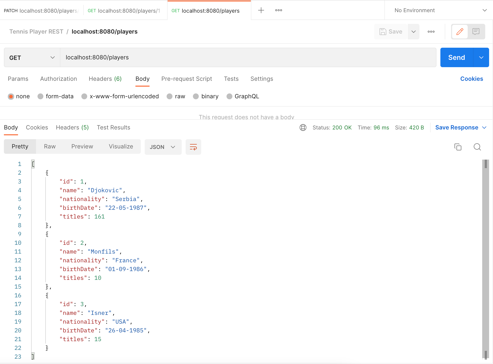

# Lesson 9: @PatchMapping

## Overview

### Partial update

The `PUT` method described in the last lesson updates the whole record. There may be a scenario when only one or two fields needs to be updated. In that case, sending the whole record does not make sense. The HTTP `PATCH` method is used for partial updates.

Sometimes we may need to update a single field. The `player` entity we've been using so far only has a few fields and `PUT` can be used for update. But if the entity is large and contains nested objects, it will have a performance impact to send the whole entity only to update a single field.

In our example, partial request means that we only send the `titles` in the request body instead of the whole `Player` object. If we use `PUT` to send a partial request, the `titles` will be modified but _all_ other fields are set to __null__. `PATCH` comes in handy in such situations. 



In the `PlayerService` class, we implement a method to handle partial updates to the `Player` object. The method `patch` has two arguments: `id` of the player on which the patch is to be applied, and the `Map` containing the key-value pairs of the fields that will be updated. The key (field name) is a `String` while the value is an `Object` as it can have different data types.

We use the `id` to fetch the existing `Player` object from the database using the `findById` method of the `JpaRepository`, which loads the entity from the database. The `findById` method returns an `Optional` and we need to check if a `Player` object is returned using the `isPresent()` method.

```java
public Player patch(int id, Map<String, Object> partialPlayer) {
    Optional<Player> player = repo.findById(id);
    if (player.isPresent()){
        //update fields using Map
    }
    return repo.save(player);               
}
```

## Demonstrated Concepts

### Using reflection

Next, we loop through the `Map`, find the field that will be updated, and then change the value of that field in the existing `Player` object that we have retrieved from the database. 

The __Reflection API__ is used to examine and modify fields, methods, and classes at runtime. It allows access to the private fields of a class and can be used to access the fields irrespective of their access modifiers. Spring provides the `ReflectionUtils` class for handling reflection and working with the __Reflection API__.

- The `ReflectionUtils` class has a `findField` method to identify the field of an object using a `String` name. 

    The `findField` method takes two arguments, the _class_ having the field and the _name_ of the field which in our case is contained in the variable `key`. 

    This method returns a `Field` object.
    
    ```java
    Field field = ReflectionUtils.findField(Player.class, key);
    ```
  
- To _set_ a value for this `field`, we need to set the field’s _accessible flag_ to `true`. 

    ReflectionUtils `setAccessible` method, when called on a field, toggles its accessible flag. 

    We can also use another method called `makeAccessible`. This method makes the given `field` _accessible_ by calling the `setAccessible(true)` method if necessary.

    ```java
    ReflectionUtils.makeAccessible(field);
    ```
  
- Lastly, we call the `setField` method and use the value from the `Map` to set the field in the `player` object. 

    The `setField` method takes three arguments, the _reference_ of the field, the object in which the field is to be set, and the value to set. This method _requires_ that the given field is accessible.

    ```java
    ReflectionUtils.setField(field, player.get(), value);
    ```
  
    Here, we have used the `get` method on the `Optional` player object to retrieve it.

In this way using reflection, a field can be updated in an object. Since we are passing the fields to be updated as a `Map`, we use the above steps while iterating through the map of key-value pairs as follows:

```java
partialPlayer.forEach( (key, value) -> {
    Field field = ReflectionUtils.findField(Player.class, key);
    ReflectionUtils.makeAccessible(field);
    ReflectionUtils.setField(field, player.get(), value);
});
```

At the end we call the `save` method to update the `player` record. The complete code of the method is shown below:

```java
public Player patch( int id, Map<String, Object> partialPlayer) {

    Optional<Player> player = repo.findById(id);
    
    if(player.isPresent()) {
        partialPlayer.forEach( (key, value) -> {
            Field field = ReflectionUtils.findField(Player.class, key);
            ReflectionUtils.makeAccessible(field);
            ReflectionUtils.setField(field, player.get(), value);
        });
    }
    return repo.save(player.get());             
}
```

### `@PatchMapping`

Now, we write a controller method called `partialUpdate` to handle `PATCH` mapping. It has an `@PatchMapping` annotation with endpoint `/players/{id}`, where `id` is a path variable. The method takes a `Map` argument containing the key-value pair of the fields we want to update. 

Since the field names are `String` and the values can be any datatype, we will use `Map<String, Object>`. The list of fields and their values will come in the request body and the `@RequestBody` annotation binds the JSON to the `Map` variable.

```java
@PatchMapping("/players/{id}")
public Player partialUpdate( @PathVariable int id, 
                             @RequestBody Map<String, Object> playerPatch) {
    //call service layer method for patch   

}
```

The `@PatchMapping` is a shortcut annotation. It is the same as:

```java
@RequestMapping(method = RequestMethod.PATCH);
```

Inside the method, we simply delegate the call to the service method and pass the player `id` and the `Map` with the fields to be updated, along with their values.

```java
@PatchMapping("/players/{id}")
public Player partialUpdate(@PathVariable int id, @RequestBody Map<String, Object> playerPatch) {
    return service.patch(id, playerPatch);
}
```

To test, use Postman to send a `PATCH` request to `localhost:8080/players/1`. The request body in JSON format will look like this:

```json
{
    "titles": 161
}
```



After the request has been sent, the player with `id` 1 now has titles 161. This can be verified by creating a `GET` request to `localhost:8080/players/1`.



We can also verify by making a `GET` request to `localhost:8080/players`. Notice that player with `id` 1 has been partially updated in the table.

